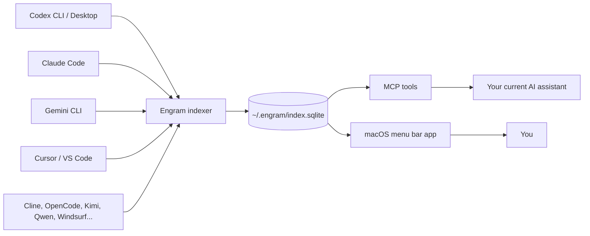
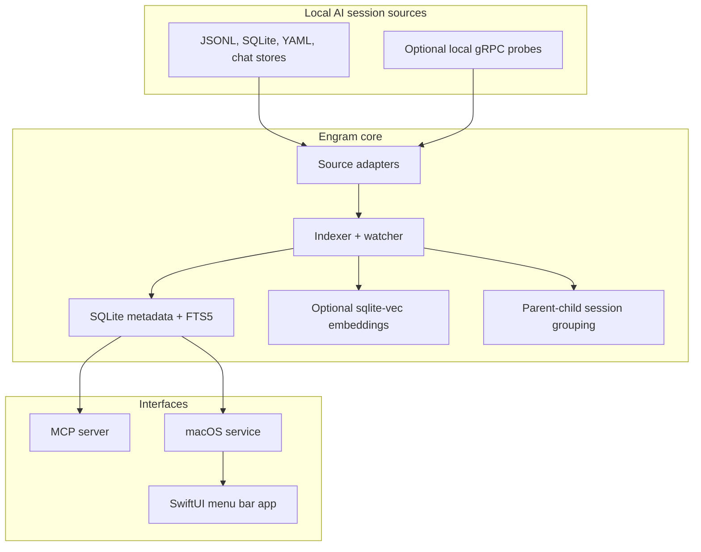

# Engram

> A local-first memory layer for AI coding tools: index your coding-agent sessions once, then search, recall, hand off, and reuse that context from any MCP-compatible assistant.

[](https://github.com/bbingz/engram/releases)
[](https://github.com/bbingz/engram/actions/workflows/test.yml)
[](LICENSE)
[](package.json)
[](macos/project.yml)

[中文说明](README.zh-CN.md) | [Privacy](docs/PRIVACY.md) | [Security](docs/SECURITY.md) | [Contributing](CONTRIBUTING.md) | [MCP tools](docs/mcp-tools.md)

---

## Why Engram exists

AI coding tools remember their own conversations, but they do not share memory with each other. A project may start in Codex, continue in Claude Code, get debugged in Cursor, and later be resumed from Gemini CLI. Without a shared memory layer, every assistant starts half-blind.

Engram reads those local session logs, builds a private SQLite index, and exposes them back through MCP tools and a macOS menu bar app.



## What it gives you

- **Cross-tool recall**: ask one assistant what happened in sessions from another assistant.
- **Hybrid search**: combine SQLite FTS5 keyword search with optional sqlite-vec semantic search.
- **Project handoff**: generate a compact project brief from recent sessions before switching tools or machines.
- **Persistent insights**: save curated knowledge with `save_insight`, then retrieve it later with `get_memory` or `get_context`.
- **Usage visibility**: inspect session counts, costs, tool usage, file hotspots, and timelines.
- **Local-first privacy**: session files are read-only inputs; the index lives under `~/.engram/`; telemetry is not collected.

## Supported sources

| Source | Session location | Status |
| --- | --- | --- |
| Codex CLI / Desktop | `~/.codex/sessions/`, `~/.Codex/projects/` | Supported |
| Claude Code | `~/.claude/projects/` | Supported |
| Gemini CLI | `~/.gemini/tmp/` | Supported |
| Cursor | `~/Library/Application Support/Cursor/.../state.vscdb` | Supported |
| VS Code Copilot | `~/Library/Application Support/Code/.../chatSessions/` | Supported |
| GitHub Copilot | `~/.copilot/session-state/<uuid>/events.jsonl` | Supported |
| Cline | `~/.cline/data/tasks/` | Supported |
| OpenCode | `~/.local/share/opencode/opencode.db` | Supported |
| iflow | `~/.iflow/projects/` | Supported |
| Qwen Code | `~/.qwen/projects/` | Supported |
| Kimi | `~/.kimi/sessions/` | Supported |
| MiniMax | `~/.minimax/sessions/` | Supported |
| Lobster AI | `~/.lobsterai/sessions/` | Supported |
| Antigravity | gRPC + `~/.gemini/antigravity/` | Supported |
| Windsurf | gRPC + `~/.codeium/windsurf/` | Supported |

## Install

### Option 1: macOS app

Download the latest universal macOS package from [Releases](https://github.com/bbingz/engram/releases). The app bundles the Engram service, indexer, MCP bridge, and menu bar UI.

### Option 2: run from source

Requirements:

- Node.js 20 or newer
- macOS 14+ and Xcode 16+ for the Swift app
- `xcodegen` if you build the macOS project locally

```bash
git clone https://github.com/bbingz/engram.git
cd engram
npm install
npm run build
```

## Register as an MCP server

After building from source, point your MCP client at `dist/index.js`.

### Claude Code

```bash
claude mcp add --scope user engram node /absolute/path/to/engram/dist/index.js
```

### Codex

Add this to `~/.codex/config.toml`:

```toml
[mcp_servers.engram]
command = "node"
args = ["/absolute/path/to/engram/dist/index.js"]
```

### Any MCP stdio client

```json
{
  "command": "node",
  "args": ["/absolute/path/to/engram/dist/index.js"]
}
```

## First useful calls

Ask your current assistant to call:

```json
{ "cwd": "/absolute/path/to/your/project", "task": "what I am about to work on" }
```

That invokes `get_context`, the core Engram tool. It retrieves recent project sessions, saved insights, active environment signals, and relevant search results within a token budget.

Other high-value tools:

| Tool | Use it for |
| --- | --- |
| `search` | Search all indexed sessions with keyword, semantic, or hybrid mode |
| `get_session` | Open one session transcript by ID |
| `save_insight` / `get_memory` | Store and retrieve durable project knowledge |
| `handoff` | Generate a project handoff brief |
| `project_timeline` | See what happened across tools over time |
| `stats`, `get_costs`, `tool_analytics`, `file_activity` | Inspect usage and work patterns |
| `project_move`, `project_archive`, `project_undo` | Move or archive local projects while preserving session history |

See [MCP tools reference](docs/mcp-tools.md) for the full list.

## Runtime architecture



## Search model

Engram supports three search modes:

| Mode | Backing technology | Best for |
| --- | --- | --- |
| `keyword` | SQLite FTS5 trigram index | Exact terms, code symbols, file names, session IDs |
| `semantic` | Embeddings + sqlite-vec | Conceptual recall across different wording |
| `hybrid` | Reciprocal Rank Fusion | Default mode; combines both result sets |

Semantic search is optional. If no embedding provider is configured, Engram falls back to keyword search and text-only memories.

## Privacy model

Engram is local-first:

- It reads source session files in read-only mode.
- It stores its own index in `~/.engram/index.sqlite`.
- It does not collect telemetry, analytics, crash reports, or personal data.
- Network features are opt-in: peer sync, AI summaries, title generation, and remote embedding providers.
- API keys used by the macOS app are stored in macOS Keychain.

Read the full [privacy policy](docs/PRIVACY.md) and [security policy](docs/SECURITY.md).

## Development

```bash
npm run build          # TypeScript -> dist/
npm test               # Vitest suite
npm run lint           # Biome check
npm run knip           # Dead-code detection
```

macOS app:

```bash
cd macos
xcodegen generate
xcodebuild -project Engram.xcodeproj -scheme Engram -configuration Debug build
```

The generated Xcode project is derived from `macos/project.yml`; edit the YAML and regenerate instead of editing `Engram.xcodeproj` by hand.

## Contributing

Contributions are welcome. Start with [CONTRIBUTING.md](CONTRIBUTING.md), keep changes scoped, and run the relevant checks before opening a pull request.

## License

Engram is released under the [MIT License](LICENSE).
