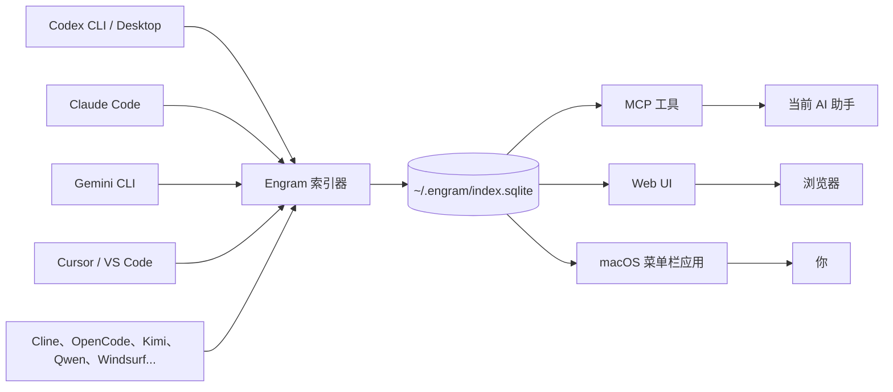
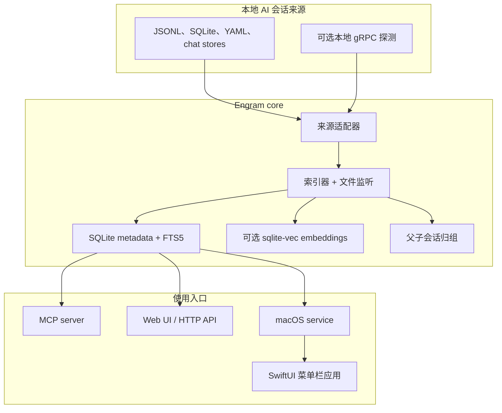

# Engram

> 面向 AI 编程工具的本地优先记忆层：一次索引 Codex、Claude Code、Cursor、Gemini CLI 等工具的历史会话，再通过 MCP 和 macOS 菜单栏应用重新使用这些上下文。

[](https://github.com/bbingz/engram/releases)
[](https://github.com/bbingz/engram/actions/workflows/test.yml)
[](LICENSE)
[](package.json)
[](macos/project.yml)
[](#raspberry-pi--linux-headless)

[English](README.md) | [隐私](docs/PRIVACY.md) | [安全](docs/SECURITY.md) | [贡献指南](CONTRIBUTING.md) | [MCP 工具](docs/mcp-tools.md)

---

## 为什么需要 Engram

AI 编程工具各自保存自己的历史，但它们之间不共享记忆。一个项目可能从 Codex 开始，在 Claude Code 里继续，在 Cursor 里调试，几天后又从 Gemini CLI 接上。没有统一记忆层时，每个助手都像第一次见到这个项目。

Engram 会读取这些本地会话日志，建立私有 SQLite 索引，并通过 MCP 工具、Web UI 和 macOS 菜单栏应用把历史上下文重新交给当前助手。



## 能做什么

- **跨工具回忆**：让当前助手查询另一个助手里的历史工作。
- **混合搜索**：SQLite FTS5 关键词搜索 + 可选 sqlite-vec 语义搜索。
- **项目交接**：切换工具或机器前生成一份项目 handoff brief。
- **持久记忆**：用 `save_insight` 保存关键知识，再用 `get_memory` 或 `get_context` 找回。
- **Web 控制台**：在本地浏览器里浏览会话、搜索、查看统计、配置同步和检查项目时间线。
- **用量洞察**：查看会话数量、成本、工具调用、文件热点和时间线。
- **本地优先隐私**：源日志只读，索引存放在 `~/.engram/`，不收集遥测。

## 支持的来源

| 来源 | 会话位置 | 状态 |
| --- | --- | --- |
| Codex CLI / Desktop | `~/.codex/sessions/`, `~/.Codex/projects/` | 支持 |
| Claude Code | `~/.claude/projects/` | 支持 |
| Gemini CLI | `~/.gemini/tmp/` | 支持 |
| Cursor | `~/Library/Application Support/Cursor/.../state.vscdb` | 支持 |
| VS Code Copilot | `~/Library/Application Support/Code/.../chatSessions/` | 支持 |
| GitHub Copilot | `~/.copilot/session-state/<uuid>/events.jsonl` | 支持 |
| Cline | `~/.cline/data/tasks/` | 支持 |
| OpenCode | `~/.local/share/opencode/opencode.db` | 支持 |
| iflow | `~/.iflow/projects/` | 支持 |
| Qwen Code | `~/.qwen/projects/` | 支持 |
| Kimi | `~/.kimi/sessions/` | 支持 |
| MiniMax | `~/.minimax/sessions/` | 支持 |
| Lobster AI | `~/.lobsterai/sessions/` | 支持 |
| Antigravity | gRPC + `~/.gemini/antigravity/` | 支持 |
| Windsurf | gRPC + `~/.codeium/windsurf/` | 支持 |

## 安装

### 方式一：macOS 应用

从 [Releases](https://github.com/bbingz/engram/releases) 下载最新 universal macOS 包。应用内包含 Engram service、索引器、MCP bridge 和菜单栏 UI。

### 方式二：从源码运行

要求：

- Node.js 20 或更新版本
- 构建 Swift 应用需要 macOS 14+ 和 Xcode 16+
- 本地生成 Xcode 项目需要 `xcodegen`

```bash
git clone https://github.com/bbingz/engram.git
cd engram
npm install
npm run build
```

### Raspberry Pi / Linux headless

Engram 的 TypeScript server 可以脱离 macOS 应用运行。Raspberry Pi、家用服务器或 Linux 机器可以使用 MCP server + daemon + Web UI 来索引本机会话日志。

```bash
git clone https://github.com/bbingz/engram.git
cd engram
npm install
npm run build
node dist/daemon.js
```

然后在这台机器上打开 `http://127.0.0.1:3457`。

如果要从局域网访问，必须在 `~/.engram/settings.json` 里显式配置 host、CIDR allowlist 和 bearer token：

```json
{
  "httpHost": "0.0.0.0",
  "httpPort": 3457,
  "httpAllowCIDR": ["192.168.0.0/16"],
  "httpBearerToken": "replace-with-a-long-random-token"
}
```

macOS 菜单栏应用和 macOS-only 集成不能在 Raspberry Pi 上运行；MCP server、daemon、Web UI、索引、搜索、记忆和项目整理工具可以通过 Node.js 20+ 源码构建运行。

## 注册为 MCP Server

源码构建完成后，把 MCP 客户端指向 `dist/index.js`。

### Claude Code

```bash
claude mcp add --scope user engram node /absolute/path/to/engram/dist/index.js
```

### Codex

写入 `~/.codex/config.toml`：

```toml
[mcp_servers.engram]
command = "node"
args = ["/absolute/path/to/engram/dist/index.js"]
```

### 其他 MCP stdio 客户端

```json
{
  "command": "node",
  "args": ["/absolute/path/to/engram/dist/index.js"]
}
```

## 第一次怎么用

让当前 AI 助手调用：

```json
{ "cwd": "/absolute/path/to/your/project", "task": "你接下来要做的事" }
```

这会调用 Engram 的核心工具 `get_context`，在 token 预算内取回当前项目的近期会话、已保存记忆、活跃环境信息和相关搜索结果。

常用工具：

| 工具 | 用途 |
| --- | --- |
| `search` | 用 keyword、semantic 或 hybrid 模式搜索所有会话 |
| `get_session` | 按 ID 打开单个会话全文 |
| `save_insight` / `get_memory` | 保存和检索长期项目知识 |
| `handoff` | 生成项目交接简报 |
| `project_timeline` | 查看跨工具项目时间线 |
| `stats`, `get_costs`, `tool_analytics`, `file_activity` | 分析使用量和工作模式 |
| `project_move`, `project_archive`, `project_undo` | 移动或归档本地项目，并保留会话历史关联 |

完整列表见 [MCP tools reference](docs/mcp-tools.md)。

## Web UI

daemon 默认会启动本地 Web UI：

```bash
node dist/daemon.js
```

打开 `http://127.0.0.1:3457`。

Web UI 包含：

- 按来源、项目和时间筛选会话
- 查看完整 transcript，并渲染 Markdown
- 跨会话混合搜索
- 查看和使用已保存 insights / memory
- 查看统计、成本、工具分析和文件活跃度
- 项目时间线和项目别名管理
- 同步状态和手动同步触发

默认只绑定 localhost。如果要绑定到局域网地址，必须配置 `httpAllowCIDR`；非 localhost 写接口需要 bearer token 保护。

## 运行架构



## 搜索模型

| 模式 | 技术 | 适合场景 |
| --- | --- | --- |
| `keyword` | SQLite FTS5 trigram index | 精确关键词、代码符号、文件名、会话 ID |
| `semantic` | Embeddings + sqlite-vec | 不同措辞下的语义回忆 |
| `hybrid` | Reciprocal Rank Fusion | 默认模式，融合两类结果 |

语义搜索是可选能力。没有配置 embedding provider 时，Engram 会自动降级为关键词搜索和文本记忆。

## 隐私模型

Engram 是本地优先的：

- 源会话文件只读。
- 自己的索引存储在 `~/.engram/index.sqlite`。
- 不收集遥测、分析、崩溃报告或个人数据。
- 网络能力均为可选：多机同步、AI 摘要、标题生成、远程 embedding provider。
- macOS 应用使用的 API key 存在 macOS Keychain。

详见 [隐私政策](docs/PRIVACY.md) 和 [安全政策](docs/SECURITY.md)。

## 开发

```bash
npm run build          # TypeScript -> dist/
npm test               # Vitest 测试
npm run lint           # Biome 检查
npm run knip           # 死代码检查
```

macOS 应用：

```bash
cd macos
xcodegen generate
xcodebuild -project Engram.xcodeproj -scheme Engram -configuration Debug build
```

`Engram.xcodeproj` 由 `macos/project.yml` 生成；需要改项目结构时，改 YAML 后重新生成，不要手改 Xcode project。

## 参与贡献

欢迎贡献。请先阅读 [CONTRIBUTING.md](CONTRIBUTING.md)，保持改动范围清晰，并在提交 PR 前运行相关检查。

## License

Engram 使用 [MIT License](LICENSE) 发布。
